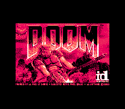
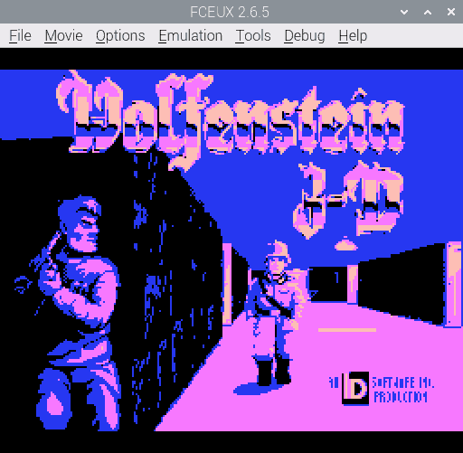

# nes-stillimage

Table of contents:
* [Introduction](#introduction)
* [png2nesdata.py](#png2nesdatapy)
* [stillimage.asm](#stillimageasm)
* [Technical info on the NES program](#technical-info-on-the-nes-program)
* [Sources of images](#sources-of-images)

## Introduction
Two programs that let you convert an image (e.g. PNG) into an NES ROM that shows the image.

## png2nesdata.py
A Python program that converts an image (e.g. PNG) into NES graphics data. Requires the [Pillow](https://python-pillow.org) module.

Command line arguments: *inputFile outputColour0 outputColour1 outputColour2 outputColour3*
* *inputFile*: the image file to read:
  * the width must be 8&ndash;256 pixels and a multiple of 8 pixels
  * the height must be 8&ndash;224 pixels and a multiple of 8 pixels
  * may only contain these colours (hexadecimal RRGGBB): `000000`, `555555`, `aaaaaa`, `ffffff`
  * if the image is too complex (has too many distinct tiles), it will be automatically simplified, which reduces the quality and takes a lot of time
* *outputColour0*&hellip;*outputColour3*: the output palette:
  * each colour is an NES colour index in hexadecimal (`00` to `3f`).
  * optional; the default is `0f 00 10 30` (greyscale)

The program writes `prg.bin` and `chr.bin`. (They will be overwritten if they already exist.)

## stillimage.asm
An NES program that displays the graphics data from `prg.bin` and `chr.bin`. The files must be generated beforehand by `png2nesdata.py`. Assembles with [ASM6](https://www.romhacking.net/utilities/674/).

To assemble, run `asm6 stillimage.asm output.nes`

## Technical info on the NES program
* PRG ROM: 16 KiB (only 2 KiB is actually used)
* CHR ROM: 8 KiB
* mapper: NROM (iNES mapper number 0)
* name table mirroring: vertical
* no raster effects
* sprite size: 8&times;16 pixels
* this data is copied from files `prg.bin` and `chr.bin`:
  * name table
  * attribute table
  * sprites
  * palette
  * horizontal scroll value
  * vertical scroll value

## Sources of images
* `doom`: shareware version of *Doom* by id Software
* `lena`: [Ethically sourced Lena picture](https://mortenhannemose.github.io/lena/) by Morten Hannemose
* `wolf`: shareware version of *Wolfenstein 3D* by id Software
