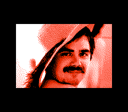

# nes-stillimage

Table of contents:
* [Introduction](#introduction)
* [How to use](#how-to-use)
* [Sources of images](#sources-of-images)

## Introduction
Two programs:
* `png2chr.py`: converts an image into NES graphics data
* `stillimage.asm`: displays the image on the NES (assembles with ASM6)

Examples (screenshots from FCEUX):

## How to use
* get an image file: 192&multi;128 pixels, up to 4 colours (`#000000`, `#555555`, `#aaaaaa`, `#ffffff`); there are examples under `test-in/`
* create NES graphics data: `python3 png2chr.py image.png chr.bin`
* set output palette: e.g. `echo "hex 0f 15 26 30" > palette.asm`
* assemble: `asm6 stillimage.asm program.nes`
* run `program.nes` in an NES emulator

See also `test.sh` (warning: it deletes files).

## Sources of images
* `doom.png`: shareware version of *Doom* by id Software
* `lena.png`: [Ethically sourced Lena picture](https://mortenhannemose.github.io/lena/) by Morten Hannemose

