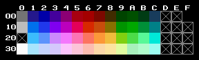

# nes-stillimage

Table of contents:
* [Introduction](#introduction)
* [png2nesdata.py](#png2nesdatapy)
* [stillimage.asm](#stillimageasm)
* [Technical info on the NES program](#technical-info-on-the-nes-program)
* [Sources of images](#sources-of-images)

## Introduction
Two programs that let you convert an image (e.g. PNG) into an NES ROM that shows the image.

## png2nesdata.py
A Python program that converts an image (e.g. PNG) into NES graphics data. Requires the [Pillow](https://python-pillow.org) module.

Command line argument: *inputFile*

*inputFile* is the image file to read:
  * the width must be 8&ndash;256 pixels and a multiple of 8 pixels
  * the height must be 8&ndash;224 pixels and a multiple of 8 pixels
  * may not contain more than 4 distinct colours
  * each colour must correspond to a distinct NES colour (otherwise try making the colours more distinct from each other)
  * if the image is too complex (has too many distinct tiles), it will be automatically simplified which reduces the quality

The program uses the NES palette `FCEUX.pal` from FCEUX. It is reproduced below for your convenience. Colours not used by the program have been crossed over in grey.

The program writes `prg.bin` and `chr.bin`. (They will be overwritten if they already exist.)

## stillimage.asm
An NES program that displays the graphics data from `prg.bin` and `chr.bin`. The files must be generated beforehand by `png2nesdata.py`.

Assembles with [ASM6](https://www.romhacking.net/utilities/674/). To assemble, run `asm6 stillimage.asm out.nes`

## Technical info on the NES program
* PRG ROM: 16 KiB (only 2 KiB is actually used)
* CHR ROM: 8 KiB (only 6 KiB is actually used)
* mapper: NROM (iNES mapper number 0)
* name table mirroring: vertical
* no raster effects (e.g. changing name table in HBlank)
* sprite size: 8&times;16 pixels
* this data is copied from files `prg.bin` and `chr.bin`:
  * name table
  * attribute table
  * sprites
  * palette
  * horizontal scroll value
  * vertical scroll value

## Sources of images
* `apogee`: *Apogee &ndash; the height of gaming excitement* screen by Apogee
* `doom`: shareware version of *Doom* by id Software
* `keen4`: *Commander Keen: Secret of the Oracle* by id Software
* `lena`: [Ethically sourced Lena picture](https://mortenhannemose.github.io/lena/) by Morten Hannemose
* `wolf`: shareware version of *Wolfenstein 3D* by id Software
