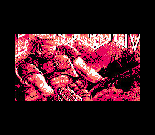
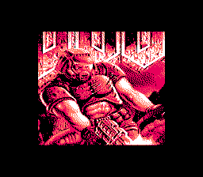
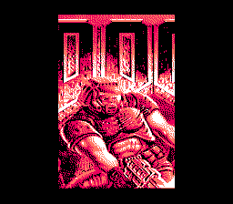
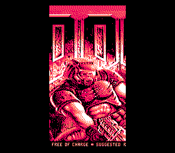

# nes-stillimage

Table of contents:
* [Introduction](#introduction)
* [png2nesdata.py](#png2nesdatapy)
* [stillimage.asm](#stillimageasm)
* [Technical info on the NES program](#technical-info-on-the-nes-program)
* [Sources of images](#sources-of-images)

## Introduction
Two programs that let you convert an image (e.g. PNG) into an NES ROM that shows the image.

Examples (screenshots from FCEUX):

## png2nesdata.py
A Python program that converts an image (e.g. PNG) into NES graphics data. Requires the [Pillow](https://python-pillow.org) module.

Command line arguments: *inputFile outputColour0 outputColour1 outputColour2 outputColour3*
* *inputFile*: the image file to read:
  * size (width&times;height) must be one of these:
    * 208&times;112 pixels (26&times;14 NES tiles)
    * 192&times;128 pixels (24&times;16 NES tiles)
    * 160&times;144 pixels (20&times;18 NES tiles)
    * 144&times;160 pixels (18&times;20 NES tiles)
    * 128&times;192 pixels (16&times;24 NES tiles)
    * 112&times;208 pixels (14&times;26 NES tiles)
  * may only contain these colours (hexadecimal RRGGBB): `000000`, `555555`, `aaaaaa`, `ffffff`
  * there are examples under `test-in/`
* *outputColour0*&hellip;*outputColour3*: the output palette:
  * each colour is an NES colour index in hexadecimal (`00` to `3f`).
  * optional; the default is `0f 00 10 30` (greyscale)

The program writes `prg.bin` and `chr.bin`. (They will be overwritten if they already exist.)

## stillimage.asm
An NES program that displays the graphics data from `png2nesdata.py`. Needs the files `prg.bin` and `chr.bin`. Assembles with [ASM6](https://www.romhacking.net/utilities/674/)).

To assemble, run `asm6 stillimage.asm output.nes`

## Technical info on the NES program
* PRG ROM: 16 KiB (only 2 KiB is actually used)
* CHR ROM: 8 KiB
* mapper: NROM (iNES mapper number 0)
* name table mirroring: vertical
* no raster effects
* sprite size: 8&times;16 pixels
* data copied from files generated by `png2nesdata.py`:
  * name table
  * attribute table
  * sprites
  * palette
  * horizontal scroll value
  * vertical scroll value

## Sources of images
* `doom.png`: shareware version of *Doom* by id Software
* `lena.png`: [Ethically sourced Lena picture](https://mortenhannemose.github.io/lena/) by Morten Hannemose

