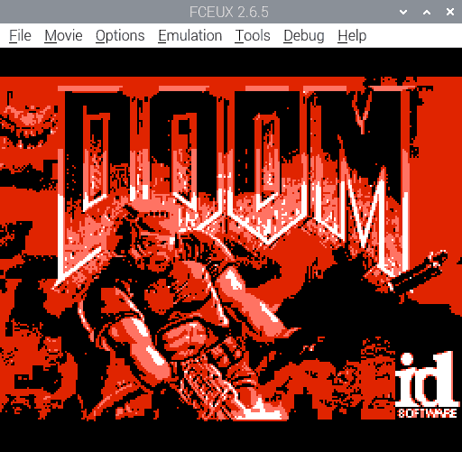

# nes-stillimage

Table of contents:
* [Introduction](#introduction)
* [How to use](#how-to-use)
* [Sources of images](#sources-of-images)

## Introduction
Two programs:
* `png2chr.py`: a Python program that converts an image (e.g. PNG) into NES graphics data
* `stillimage.asm`: an NES program that displays the converted graphics data (assembles with [ASM6](https://www.romhacking.net/utilities/674/))

Examples (screenshots from FCEUX):

## How to use
1. get an image file: 192&times;128 pixels, up to 4 colours (`#000000`, `#555555`, `#aaaaaa`, `#ffffff`); there are examples under `test-in/`
1. write NES graphics data to `chr.bin`: `python3 png2chr.py image.png chr.bin`
1. write output palette to `palette.asm`: e.g. `echo "hex 0f 15 26 30" > palette.asm`
1. assemble: `asm6 stillimage.asm stillimage.nes`
1. run `stillimage.nes` in an NES emulator

See also `test.sh` (warning: it deletes files).

## Sources of images
* `doom.png`: shareware version of *Doom* by id Software
* `lena.png`: [Ethically sourced Lena picture](https://mortenhannemose.github.io/lena/) by Morten Hannemose

